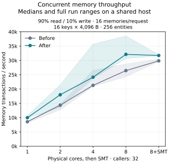

# Concurrent memory performance follow-up

Baseline: `2ad8f30` (the previous performance work), committed and pushed before
this pass. This report compares fresh builds of that revision and the follow-up
implementation using the same expanded workload. Absolute rates from the earlier
report are not interchangeable with these measurements.

The useful improvement is less repeated work when a worker calls several larger,
multi-key memories concurrently. Small mixed transactions do not show a consistent
gain, and scaling remains sublinear. This pass preserves durable commits and the
existing shard/lease architecture.

The broad sweep measured the bounded-cache implementation before a final Unicode
correctness fix. The final executable was rebuilt and measured separately; the
sections below distinguish those stages. No completed samples were discarded.

## Final executable results

The final candidate is `eee87e4736cb2a9456d7b7094e769828fba41f5dbbbc19e665bebe8ad98a6105`.
[Full final tables](MEMORY-FANOUT-FOLLOWUP-FINAL-RESULTS.md) cover **54 processes
and 1,618,004 completed writes**, all verified live and after reopening.
The host's one-minute load ranged from 3.89 to 30.40.

At **eight physical cores and 32 concurrent requests**, larger memories contain
16 fields of 4 KiB varied payloads across 256 entities. Small cases have one
128-byte field across 1,024 entities. Throughput changes are median ratios of
matched pairs; rates and p99 are separate medians, so dividing the displayed
rates can give a different percentage.

| Workload | Memory transactions/s, before → after | Paired change (full ratio range) | Request p99, before → after |
|---|---:|---:|---:|
| Larger state, read, 16 memories/request | 47,578 → 74,730 | +58% (1.57–1.64×) | 66.41 → 35.82 |
| Larger state, 90% read / 10% write, 16 memories/request | 26,442 → 32,125 | +16% (1.12–1.58×) | 86.97 → 83.27 |
| Larger state, write, 16 memories/request | 13,064 → 18,155 | +36% (0.90–1.41×) | 88.13 → 50.84 |
| Small state, mixed, 4 memories/request | 81,744 → 58,786 | -25% (0.69–0.99×) | 13.90 → 28.05 |
| Small state, mixed, 16 memories/request | 83,115 → 83,699 | +1% (0.98–1.05×) | 41.10 → 41.16 |

The repeated larger-state gains support retaining this change, but **the small
four-memory regression remains unresolved**. Its shorter final comparison lost
25% throughput and roughly doubled median p99. The diagnostic below demonstrates
measurement variation; it does not prove the implementation has no regression.
These shared-host measurements do not establish a universal percentage improvement
or guarantee better tail latency.

For the larger-state mixed workload, core scaling was:

| Allowed CPUs | Transactions/s, before → after | Median paired change |
|---:|---:|---:|
| 1 | 8,571 → 9,987 | +21% |
| 2 | 14,364 → 18,002 | +23% |
| 4 | 21,293 → 24,137 | +13% |
| 8 | 26,442 → 32,125 | +16% |
| 8 + SMT | 29,853 → 31,733 | +6% |

The final candidate gains **3.22× from one to eight physical cores**, versus
3.09× for the baseline. SMT adds no throughput here. This is useful additional
throughput within the existing architecture, with modest scaling efficiency;
it is not near-linear scaling.



Median whole-process peak RSS for larger read/mixed/write workloads was
900/838/698 MiB before and
763/723/737 MiB after. The bounded
JavaScript cache can increase write-only RSS; the read/mixed cases use less in
this comparison. Native snapshot misses during the timed fitting mixed/write
workloads fall from about 10%/100% to zero. The response and restart checks still
validate every payload and exact write sequence.

## What changed

- Mutation, effect, and command-result bytes enter their native batch directly.
  The intermediate upload operation and temporary input byte handles are gone.
- `MemoryCommit` owns its payload and lease through the writer queue and retries.
  Snapshot and mutation values use immutable `Bytes`; complete native snapshots
  use `Arc`. Returning a cached snapshot no longer copies every value or key.
  JavaScript still receives independent decoded values.
- Successful SQL operations return the previous and committed revisions to the
  shard writer. After `COMMIT`, it updates complete cached snapshots in command
  order, before acknowledging writes. Merge work happens outside the cache lock;
  publication checks that the cached base has not been replaced. Missing bases,
  revision mismatches, oversized growth, rollback, and uncertain outcomes retain
  invalidation/read-through behavior. It does not populate cold entries on writes.
- Each transaction still acquires its entity lease and checks native state. An
  exact decimal revision token lets JavaScript reuse its existing encoded snapshot
  when unchanged. Accepted mutation buffers update that mirror after commit
  acknowledgement; callback failure discards the pending records. Storage keys
  are canonicalized to the same UTF-8 representation as native storage, and list
  ordering has a deterministic tie-break for distinct keys with equal collation.
  Hot and reloaded snapshots therefore agree even for malformed UTF-16 keys.
- Idle JavaScript snapshots now have limits of **8 MiB of accounted bytes and
  4,096 entities per isolate**. Active transactions remove their snapshots from
  the idle eviction list until completion. Oversized snapshots are discarded on
  release. These are cache-accounting limits, not whole-process RSS limits.

The 32 database shards, dedicated shard writers, two read connections per shard,
bounded queues, `FULL` commits, busy timeout and retry bounds, persisted version
floors, callback-once behavior, idempotency, and durable outbox remain in place.
The native cache keeps its existing 64 MiB / 4,096-entry budget.

## Workloads and measurement

The worker calls 1, 4, or 16 distinct memories with `Promise.all`. It checks every
response and validates exact per-entity write sequences, final state, and every
field again after shutting down and reopening the durable store.

The expanded harness supports 1–256 keys per entity and repeated or deterministic
varied printable payloads. Multi-key cases have a mutable `state` record and
immutable additional fields. Every transaction reads the state and one rotating
field; writes update the state counter and preserve its payload. Final verification
checks every field. The worker's expected-payload cache is identical in both
builds and bounded to 4,096 entries; workload code and its validation cost are
included in the measurements.

Runs use separate fresh stores on the same physical NVMe/btrfs filesystem,
matched `dist` builds, physical-core-first affinity, 1 second of warmup, and
6 seconds of timed work. Three paired rounds alternate binary order and reverse
workload/core order. Completed samples are retained, including regressions.
Build records verify source, benchmark, toolchain, profile, configuration, and
executable hashes. These are in-process `RuntimeService` measurements, excluding
network transport. HTTP behavior is verified separately.

With 32 concurrent callers, the service starts 1/2/4/8/8 isolates at
1/2/4/8/16 allowed CPUs. The 16-CPU point adds SMT availability; it does not use
16 active JavaScript isolates. The mixed workload makes 90% of requests read-only
and 10% write to each memory in their fanout.

This is a shared Ryzen 7800X3D host with eight physical cores and 16 SMT threads.
Unrelated jobs were left running. Ranges show every pair ratio (three per group, or five in the focused
small-workload follow-up), not confidence intervals. Whole-process CPU time and peak RSS include initialization,
seeding, warmup, verification, and reopening; they are not timed service-only
measurements.

## Small-workload diagnostic

[Diagnostic tables](MEMORY-FANOUT-FOLLOWUP-DIAGNOSTICS.md) retain two additional
six-process campaigns. Both use the same small four-memory mixed workload and
physical storage as the main comparisons.

First, the comparison ran the **identical baseline executable on both sides**.
Across six processes it ranged from 40,566 to 90,571 transactions/s; paired ratios
were 0.90×, 1.07×, and 1.02×. This demonstrates substantial variation without any
code change. In the earlier final comparison, slower processes also had longer
startup/seed phases and more host I/O-wait time. Those observations are consistent
with changing storage conditions but do not isolate the cause of the regression.

Second, final-versus-baseline runs used **5 seconds of warmup and 20 seconds of
timed work**. The three throughput ratios were **0.60×, 0.92×, and 1.15×**; paired
p99 ratios were 2.42×, 1.19×, and 0.89×. The median throughput change is −8%.
All runs verified exact live and reopened state. The measurements support neither
a consistent gain for this workload nor a claim that its regression is resolved.
No workload-specific thresholds or durability changes were introduced in response.

## Broad sweep before the Unicode correction

[All broad-sweep tables](MEMORY-FANOUT-FOLLOWUP-RESULTS.md) cover **146 processes
and 5,920,737 completed writes**. The candidate is `5dd1b626…`; it includes the
same bounded caching and ownership design as the final build, before the key
canonicalization/list-order correction. These are supporting measurements, not
measurements of the final executable.

At eight physical cores and 32 concurrent requests:

| Workload | Median paired throughput change | Request p99, before → after |
|---|---:|---:|
| Read, 16 memories/request, 256 entities, 16 × 4 KiB varied fields | +57% | 60.18 → 39.50 ms |
| 90% read / 10% write, same larger state | +46% in holdouts; +12% in the separate core sweep | 58.18 → 43.22 ms in holdouts; 79.34 → 81.40 ms in the core sweep |
| Write, same larger state | +39% | 61.77 → 46.74 ms |
| Read, 16 memories/request, 1,024 entities, 128 B | +9% | 3.91 → 3.55 ms |
| Write, 16 memories/request, 1,024 entities, 4 KiB | +2%, with individual pairs from −28% to +10% | 31.04 → 29.84 ms |
| Read / mixed, 16 memories/request, 8,192 entities, 128 B | −1% / −3% | 11.40 → 11.11 / 22.35 → 24.65 ms |

The initial small four-memory mixed holdout regressed **24%**, with p99 rising
from 11.18 to 27.53 ms. A five-pair follow-up measured +3%; pooling all eight pairs
gives approximately +1%, with individual ratios from 0.74× to 1.09×. Small
16-memory mixed results were similarly variable and broadly flat. The follow-up
does not erase the original regression or establish a consistent speedup.

The larger-state mixed candidate scaled **3.10× from one to eight physical
cores**; the baseline scaled 3.29×. Small mixed scaled 3.42× versus 3.56×. Thus this
pass reduced work on larger state without materially improving scaling efficiency.
At fixed 32 outstanding memory transactions, increasing fanout reduced the number
of concurrent requests and active isolates: widths 1/4/16 used 8/2/1 isolates.
Those controls were roughly flat at widths 4 and 16. A single request's JavaScript
callbacks still run on one isolate; concurrent memory calls overlap storage waits.

In the larger-state read/mixed holdouts, median whole-process peak RSS fell from
899/853 MiB to 755/739 MiB. Write-only cases increased about **4–9%**, a cost of
retaining bounded JavaScript snapshots. Cache bytes and process RSS are different
quantities; there is no universal memory reduction.

Two earlier 24-process experiments are also retained in the raw archive. Direct
buffer/ownership changes alone did not consistently improve throughput. Adding
native cache publication eliminated timed misses in the fitting working sets,
but its gains alone were modest and inconsistent. The combined design's larger
benefit came with avoiding repeated JavaScript snapshot hydration. An unbounded
JavaScript-cache draft was built but never benchmarked or retained in the final
implementation.

## Verification

- `just check`: **398 Rust tests and 30 JavaScript tests**, formatting, workspace
  checks, and Clippy. Four ignored entries are subprocess fixtures or generated
  Deno doctests; the subprocess parents run their fixtures.
- New coverage checks grouped writes and rollback fallback against SQL, tombstone
  and revision preservation, native cache growth limits, oversized input rejection,
  independent decoded values on reused snapshots, rollback of pending records,
  JavaScript cache eviction / oversized snapshot behavior, and Unicode key/list
  consistency before and after eviction.
- Fresh `dd_server` and `dd_dev_runtime` binaries pass the HTTP memory fanout,
  streaming, cancellation, native/proxied WebSocket, and chat checks.
- A physical-disk SIGKILL check verifies acknowledged KV and memory writes and
  deletes, idempotent replay, and worker isolation across restart.

Logs: [project checks](/tmp/dd-fanout-next-unicode-check.log),
[HTTP and sockets](/tmp/dd-fanout-next-unicode-http-transport.log),
[crash recovery](/tmp/dd-fanout-next-unicode-crash-recovery.log).

## Retained artifacts

The [compressed raw archive](/home/mewhhaha/dd-fanout-followup-measurements-20260907.json.gz)
contains all 14 campaigns (262 processes), six build records and source patches,
per-process output and host/thread counters, verification logs, and the scripts.
Its SHA-256 is
`27265bc39baa71e03e095e720d68470e6b790f24c6b7a38201e1a0c842546b94`.
The archive includes the isolated experiments and the superseded, unmeasured
unbounded-cache build; its stage descriptions distinguish them from the final
implementation. Artifact paths are local to the measurement host.

The [final build record](/home/mewhhaha/dd-fanout-next-unicode-build-20260907/build-record.json)
and [source patch](/home/mewhhaha/dd-fanout-next-unicode-build-20260907/source.patch)
identify the measured code. Later changes are reports and summarizer text only;
the current production and benchmark source patch matches the final build.
The previous checkpoint was pushed as `2ad8f30`; follow-up measurements used the
working-tree patches archived above.

## Reproduction

Use [build-state-benchmarks.py](../scripts/build-state-benchmarks.py) to build
`bench_memory_fanout` from the checkpoint and candidate, copying the same benchmark
Rust file and adjacent worker directory into the checkpoint checkout first. Keep
each executable with its build record outside the source tree.

```sh
python3 scripts/compare-memory-fanout.py \
  --baseline /path/to/before/bench_memory_fanout \
  --baseline-record /path/to/before/build-record.json \
  --candidate /path/to/after/bench_memory_fanout \
  --candidate-record /path/to/after/build-record.json \
  --output /path/to/fresh-nvme-results \
  --cpu-count 1 --cpu-count 2 --cpu-count 4 --cpu-count 8 --cpu-count 16 \
  --concurrency 32 --pairs 3 --duration-ms 6000 --warmup-ms 1000 \
  --case mixed:16:1024:128 \
  --case mixed:16:256:4096:16:varied

python3 scripts/summarize-memory-fanout.py /path/to/results
```

Case syntax: `MODE:WIDTH:POPULATION:BYTES[:KEYS_PER_ENTITY:PAYLOAD_KIND]`.

The [exact final comparison commands](/tmp/dd-fanout-next-unicode-measure.sh)
are also stored in the archive. To regenerate the final tables and plot from
retained results:

```sh
python3 scripts/summarize-memory-fanout.py \
  /home/mewhhaha/dd-fanout-next-unicode-large-cores-20260907 \
  /home/mewhhaha/dd-fanout-next-unicode-holdouts-20260907 \
  --plot benchmarks/memory-fanout-followup-scaling.svg \
  > benchmarks/MEMORY-FANOUT-FOLLOWUP-FINAL-RESULTS.md
```
