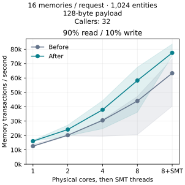
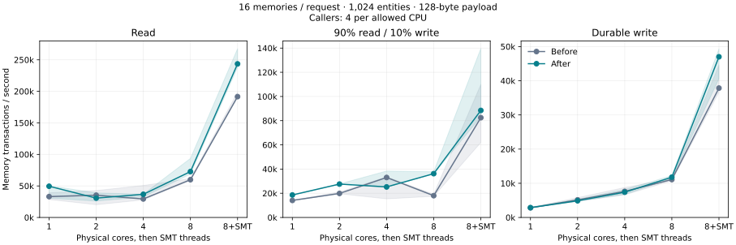

# Concurrent memory performance: 2026-09-07

Comparison against `3336f8f7ad717df7a0c324a215438563a7d39832`, the committed
service after the storage/runtime consolidation. This measures workers calling
several independent memories with `Promise.all`.

## Main results

At eight physical cores, sixteen-memory mixed requests achieved **1.53×** the
paired baseline throughput in the interleaved, fixed-caller comparison, and
**2.01×** in the earlier main matrix. Both use 32 callers at that CPU count.
Cache misses fell from nearly every transaction to roughly the write fraction.
This avoids real database snapshot work rather than changing the operation or
acknowledgement contract.

Main workload: one hardware thread on each of eight physical cores, 1,024
entities, 128-byte payload, 32 concurrent callers, three
alternating baseline/candidate pairs, six seconds of timed work after one second
of warmup. Rates and latencies below are separate medians; gain is the median of
matched candidate/baseline throughput ratios.

| Workload on 8 physical cores | Requests/s before → after | Memory transactions/s before → after | Paired gain | Request p99 ms before → after |
|---|---:|---:|---:|---:|
| Read, 16 memories | 3,743 → 4,546 | 59,887 → 72,730 | 1.21× | 23.91 → 20.51 |
| 90% read / 10% write, 16 memories | 1,126 → 2,263 | 18,010 → 36,203 | 2.01× | 91.17 → 61.14 |
| Durable write, 16 memories | 693 → 737 | 11,090 → 11,786 | 1.04× | 89.70 → 78.90 |
| 90% read / 10% write, 4 memories | 5,353 → 6,548 | 21,414 → 26,193 | 1.22× | 39.54 → 28.16 |

The result is not a universal throughput or latency improvement. The main
all-write cases on two and four cores measured paired throughput ratios of
0.92× and 0.93×. The one-core four-memory mixed case had a 1.17× paired p99 ratio
despite higher throughput. All completed pairs remain in the results. Shared
host interference is large enough that separate median rates and median paired
ratios can point in different directions; neither should be treated as a clean
capacity estimate.

Independent eight-core holdouts confirm where the change helps. With sixteen
memories and 4 KiB payloads, median paired throughput ratios were **1.29× read,
2.01× mixed, and 1.19× write**; paired p99 ratios were 0.79×, 0.70×, and 0.77×.
With 8,192 entities, beyond the 4,096-entry cache, ratios were 0.99× read and
1.09× mixed. Four-memory read-only requests measured 0.94× throughput and 1.12×
p99; four-memory writes measured 1.05× throughput. The single-memory controls
were essentially unchanged: 1.02× read and 0.97× write. These controls are
included to expose workload tradeoffs; they are not the optimization target.

## Core scaling with 32 callers

This comparison keeps offered concurrency fixed and interleaves CPU counts
across paired rounds. It tests sixteen-memory mixed requests with 1,024 entities
and 128-byte payloads. The candidate scales **3.63× from one to eight physical
cores**, and **4.82× with SMT enabled on the same eight cores**, using the
separate median transaction rates. It does not establish linear scaling or
uncontended hardware capacity.

| CPU affinity | Started JS isolates | Transactions/s before → after | Median paired gain | Request p99 ms before → after |
|---|---:|---:|---:|---:|
| 1 physical core, 1 thread | 1 | 12,575 → 16,065 | 1.28× | 72.39 → 63.01 |
| 2 physical cores, 2 threads | 2 | 20,168 → 24,118 | 1.23× | 61.56 → 51.07 |
| 4 physical cores, 4 threads | 4 | 30,541 → 37,881 | 1.27× | 63.05 → 54.54 |
| 8 physical cores, 8 threads | 8 | 43,976 → 58,237 | 1.53× | 53.18 → 50.80 |
| 8 physical cores, 16 SMT threads | 8 | 63,317 → 77,483 | 1.22× | 43.66 → 39.13 |

At 32 callers, the scheduler needs only eight isolates with four in-flight
requests each, even when the configured maximum is sixteen. Both revisions had
the displayed isolate counts before and after every timed run.



Shading shows every sample's range, not a confidence interval. The full main
matrix also varies caller count with CPU count:



## Equal outstanding transaction controls

At eight physical cores, these mixed workloads hold `callers × fanout = 32`
constant. Wider fanout amortizes request overhead and overlaps storage work,
while fewer caller requests cause fewer JS isolates to start. A request's
synchronous callbacks remain on its caller's isolate. Fanout alone therefore
does not parallelize JavaScript execution across cores.

| Memories/request | Callers | Started isolates | Transactions/s before → after | Median paired gain |
|---:|---:|---:|---:|---:|
| 1 | 32 | 8 | 9,681 → 10,379 | 1.07× |
| 4 | 8 | 2 | 11,121 → 12,001 | 1.11× |
| 16 | 2 | 1 | 10,363 → 11,311 | 1.08× |

## Changes

- Invalidate only the memory affected by a committed transaction. Previously,
  any write invalidated every cached memory on the same storage shard, including
  unrelated KV and outbox maintenance. The writer advances the shard epoch and
  removes affected entries before replying, even if the caller has disappeared.
  Epochs still reject stale snapshot fills racing with a commit. Failed rollbacks
  also invalidate before retrying an operation whose commit outcome is uncertain.
- All handles for one state store share its bounded snapshot cache. Snapshot
  copies and destruction happen outside the cache mutex, and SQL readers return
  to their pool as soon as rows have been materialized. The existing global LRU,
  4,096-entry limit, and 64 MiB byte budget remain.
- Remove unused mutation-value copies across Rust and JavaScript when staging
  and acknowledging writes. Native batches still supply read-your-writes; the
  next transaction hydrates a fresh snapshot.
- List socket handles synchronously on first use within a transaction. Memory
  transactions without socket operations avoid the former eager asynchronous
  refresh. Failure cleanup queries the current registry and preserves the
  original storage error.

The service still acknowledges durable `FULL` commits, runs synchronous atomic
callbacks exactly once, holds ownership leases through queued writes, and
persists version floors, idempotency results, and outbox effects. No durability,
admission, cache-capacity, or database-sharding setting was changed to obtain the
results.

I also tested a shared-lock cache with deferred exact LRU updates and atomic
entry invalidation. Its 15 paired comparisons produced median ratios of 0.99×
for small reads, 1.04× for mixed requests, 1.02× for writes, 1.02× for larger reads,
and 1.07× under cache pressure, relative to the simpler candidate. Those gains
did not justify the added machinery and worst-case eviction work. That prototype
was discarded; its source patch and every run remain archived. No write-through
cache or changed commit batching policy was introduced.

## Measurement contract

The new [Rust benchmark](../crates/runtime/src/bin/bench_memory_fanout.rs) invokes
`RuntimeService` in process. Its [worker](../crates/runtime/src/bin/bench_memory_fanout/worker.js)
uses the public memory binding and `Promise.all` over distinct entities. Each
entity stores a structured counter and an entity-specific payload. Reads check
the initialized payload; writes read and increment the counter and await durable
commit. Every response is validated, and every completed write is checked
against exact counters both before shutdown and after reopening the same store.
Startup, seeding, and restart verification are excluded from throughput.

This measures the service and worker execution path, excluding network transport.
Reported p99 is for the entire request, including all its memory calls and Rust
response validation. Transaction throughput is request throughput multiplied by
fanout. Timed work stops admitting new calls at the deadline and includes the
time needed to drain already admitted calls.

The mixed workload assigns one write request in each complete ten-request block
and rotates that write slot across the entire entity population. It does not
confine writes to a small fixed subset. Warmup and timing are duration based, so
the revisions perform the same operation rule and distribution rather than an
identical finite request replay. Actual write fractions and sequence intervals
are retained in every result.

Runs use a Ryzen 7 7800X3D: eight physical cores and sixteen SMT threads. CPU sets
use cores 0–7 first, then sibling threads 8–15. Every process starts a fresh store
on `/dev/nvme0n1p2`, btrfs under `/home`; the mount uses zstd compression. Fixed
payloads are compressible, so larger-payload results do not establish
incompressible-data disk bandwidth. The machine had unrelated background work;
host load and CPU counters are retained, and no other jobs were stopped.

Both binaries use the same locked dependencies, Rust/Cargo toolchain, `dist`
profile (`opt-level=3`, thin LTO, one codegen unit), Cargo configuration, and
benchmark source hashes. Each regular isolate budget is one per allowed CPU,
with four in-flight requests per isolate and initially zero isolates. This
matches the normal CPU-derived budget except that the one-core measurement uses
one regular isolate instead of the default minimum of two. Other runtime and
storage settings use their defaults, including outbox delivery.

In the main curve, caller concurrency is four per allowed CPU. CPU availability,
Tokio threads, isolate capacity, and offered concurrency therefore scale together.
The sixteen-thread point uses the same eight physical cores, and is not evidence
of sixteen-core scaling. A single JavaScript atomic callback remains synchronous
on its caller's isolate; multiple requests can execute on separate isolates while
one request overlaps the storage work of its independent memory calls.

CPU seconds and peak RSS cover the whole benchmark process, including setup,
warmup, validation, and reopening. Faster runs retain more counter observations
for verification. These resource measurements are not isolated service-only or
timed-region CPU costs. Thread CPU sampling is approximate and is not a stack
profile.

## Verification

- `just check`: 392 Rust tests and 30 JavaScript tests passed; formatting, contract
  checks, type checking, and workspace Clippy passed. Two ignored subprocess
  fixtures are exercised by their parent tests; two generated Deno doctests
  are also ignored.
- New cache regressions cover same-shard neighbors, independently constructed
  store handles, cancellation with a warm cache, uncertain commits before retry,
  effect-only commits, outbox maintenance, and independent returned snapshots.
- Runtime regressions cover staged values and deletes, subsequent transaction
  freshness, lazy socket enumeration, accept/list/close behavior, and storage
  failure closing affected sockets while an unrelated room remains usable.
- Freshly built service binaries passed
  [the native HTTP check](../scripts/check-dd-dev-transport.mjs): eight concurrent
  HTTP callers each updating sixteen memories, full 4 KiB-plus payload validation,
  exact counters, streaming, cancellation, native/proxied WebSockets, and chat.
- [Crash verification](../scripts/verify-durable-state.py) passed on an NVMe-backed
  disposable store: acknowledged writes/deletes survive `SIGKILL`, idempotent
  commands replay once, and worker namespaces remain isolated.

The retained baseline/candidate comparisons contain **222 successful processes**
and **5,936,834 completed writes**, each checked in live and reopened state. No
completed pair was excluded. One-minute host load ranged from **12.07 to 55.66**.
The main matrix grouped runs by CPU/workload; followups interleaved groups across
paired rounds to reduce correlation with changing host load. The earlier pilot
and the two runtime/cache prototype comparisons are separate from these totals.

## Artifacts

[All measurements](MEMORY-FANOUT-RESULTS.md) include every workload, paired
ratio range, request latency, cache misses, commit grouping, CPU time, RSS, and
build fingerprints. The [compressed measurement archive](/home/mewhhaha/dd-fanout-measurements-20260907.json.gz)
contains all comparison records, including the preliminary and rejected runs,
plus the worker source and candidate/prototype patches. Raw records and logs
remain local:

- [Main matrix](/home/mewhhaha/dd-fanout-core-paired-20260907/summary.json),
  [holdouts](/home/mewhhaha/dd-fanout-holdouts-20260907/summary.json), and
  [fixed-caller scaling](/home/mewhhaha/dd-fanout-fixed-callers-20260907/summary.json).
- Equal-transaction controls:
  [one memory](/home/mewhhaha/dd-fanout-fixed-transactions-width-1-20260907/summary.json),
  [four memories](/home/mewhhaha/dd-fanout-fixed-transactions-width-4-20260907/summary.json),
  [sixteen memories](/home/mewhhaha/dd-fanout-fixed-transactions-width-16-20260907/summary.json).
- [Baseline build record](/home/mewhhaha/dd-fanout-baseline-build-20260907/build-record.json)
  and [measured candidate build record](/home/mewhhaha/dd-fanout-candidate-build-20260907/build-record.json).
  A [final rebuild](/home/mewhhaha/dd-fanout-final-build-20260907/build-record.json)
  produced the identical measured executable, SHA-256
  `8e122a07ac13863805012913a9be94514647df56e96b56f95ee99fdafa69731c`.
- [Discarded cache prototype comparison](/home/mewhhaha/dd-fanout-deferred-paired-20260907/summary.json)
  and its [reversible source patch](/home/mewhhaha/dd-fanout-deferred-paired-20260907/prototype/phase.diff).
- [Full check log](/tmp/dd-fanout-just-check.log),
  [HTTP/streaming/socket log](/tmp/dd-fanout-http-transport.log), and
  [crash recovery log](/tmp/dd-fanout-crash-recovery.log).

## Reproduction

Use [build-state-benchmarks.py](../scripts/build-state-benchmarks.py) with
`--bin bench_memory_fanout` for each revision. Copy the same benchmark Rust file
and adjacent worker directory into the baseline checkout before building. Keep
each executable and its `build-record.json` together in a separate artifact
directory; a subsequent Cargo build can replace the executable in `target/dist`.

```sh
python3 scripts/build-state-benchmarks.py \
  --bin bench_memory_fanout --source /path/to/revision \
  --target-dir /path/to/cargo-target --output /path/to/new-build-record

python3 scripts/compare-memory-fanout.py \
  --baseline /path/to/before/bench_memory_fanout \
  --baseline-record /path/to/before/build-record.json \
  --candidate /path/to/after/bench_memory_fanout \
  --candidate-record /path/to/after/build-record.json \
  --cpu-count 1 --cpu-count 2 --cpu-count 4 --cpu-count 8 --cpu-count 16 \
  --case read:16:1024:128 --case mixed:16:1024:128 \
  --case write:16:1024:128 --case mixed:4:1024:128 \
  --pairs 3 --duration-ms 6000 --warmup-ms 1000 \
  --output /path/to/new-disk-backed-results

python3 scripts/summarize-memory-fanout.py /path/to/results \
  --plot /path/to/core-scaling.svg > /path/to/measurements.md
```

The comparison runner requires Linux CPU affinity and records the mount/device,
effective configuration, alternating AB/BA order, binary/build/source hashes,
host load, responses, validation, and resource measurements. It rejects failed
runs or mismatched builds and verifies that binaries and the harness stay
unchanged. The optional plot requires Python matplotlib; the benchmark and
comparison runner add no service dependencies.
