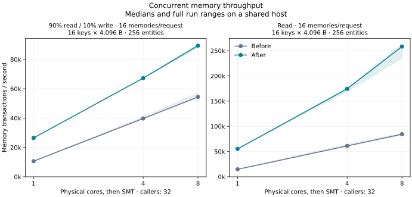

# Native memory snapshots — 2026-09-08

Memory transactions now retain their immutable snapshot in Rust and transfer
only values that the callback reads. This removes the isolate's duplicate
snapshot cache, revision comparisons, full hydration, and cache accounting.
The shared native cache remains bounded at 64 MiB and 4,096 entries.

## Results

Matched local runs, 32 callers and sixteen concurrent memories per request:

| Physical cores | Large workload | Requests/s before → after | Paired gain | p99 ms before → after |
|---:|---|---:|---:|---:|
| 1 | 90% reads / 10% writes | 664 → 1,654 | 2.49× | 75.29 → 33.73 |
| 4 | 90% reads / 10% writes | 2,483 → 4,202 | 1.70× | 38.07 → 24.88 |
| 8 | 90% reads / 10% writes | 3,402 → 5,585 | 1.64× | 39.26 → 28.24 |
| 8 | Reads | 5,277 → 16,135 | 3.03× | 31.59 → 8.74 |

Eight-core throughput is **89,355 memory transactions/s mixed** and **258,160
reads/s**. Every large-workload pair improved. Eight-core peak RSS fell from
737 to 628 MiB for mixed traffic and from 762 to 637 MiB for reads.

Scaling remains sublinear. The new implementation reaches 3.38× mixed and
4.67× read throughput on eight cores versus one. The previous implementation
reached 5.12× and 5.69× respectively: single-core throughput benefits more from
this change, so the relative scaling factor falls even though absolute
throughput improves at every measured core count.



The write-only holdout was unchanged, at about 8,100 durable memory writes/s.
Its p99 increased from 91 to 97 ms; its peak RSS fell from 723 to 591 MiB.
The small-value, four-memory mixed holdout improved by 15% in paired runs.

**The small-value, sixteen-memory mixed result is inconclusive.** The original
eight-second runs regressed 30%. Follow-up twenty-second runs showed +3%
median paired throughput, with individual ratios from 0.91× to 1.05× and
roughly unchanged median p99. An identical-binary control produced ratios of
0.52×, 0.92× and 0.94×. Small-value profiling found roughly unchanged read-only
throughput and 8–11% higher mixed throughput; those profiling rates are
diagnostic, not acceptance results. These observations establish substantial
measurement variability, not proof that the initial regression was harmless.
No gain or non-regression claim is made for this case. All samples are retained
in the [diagnostics](MEMORY-NATIVE-SNAPSHOTS-DIAGNOSTICS.md).

## Why this change

The initial profile of the previous implementation found full JavaScript
snapshot reloads in 93.5% of transactions for the large mixed workload on one
core. Its 256 memories each contained sixteen 4 KiB values, exceeding the
isolate's 8 MiB cache budget. Every transaction loaded sixteen values even
though its callback read two. Native snapshot lookup averaged 0.4 microseconds;
entity lease acquisition averaged 3.7 microseconds on one core.

Snapshot replacement appeared in 35.6% of that process's V8 samples, including
its callees. Samples cover setup, warmup, measurement, and verification, and
only the isolate threads; this percentage is not a whole-service CPU share.
The matching V8 14.9.207.2 tick processor was used. Node's bundled processor
could not read every code state in these logs and its output was discarded.
See the [V8 profiling documentation](https://v8.dev/docs/profile) for the
sampling mechanism.

Two implementations were measured. Returning all snapshot buffers in one
operation simplified the transfer but produced only a 3% median paired mixed
gain on one core and 1% on eight cores. Keeping the snapshot native eliminates
the unnecessary transfer itself. The direct-transfer trial and the native
prototype's earlier measurements are retained with the final measurements.

## Transaction behavior

The native transaction holds the existing entity lease and an immutable
`Arc<MemorySnapshot>` before running the synchronous callback. `get` checks
staged mutations first, then searches the snapshot in binary key order.
JavaScript receives an owned buffer and decodes a fresh value, so mutating a
returned object cannot change stored state. `list` merges keys, applies the
existing ordering and limit, then retrieves the selected values.

The writer still uses grouped `synchronous=FULL` transactions, bounded busy
retries, persisted version floors, and cache publication before acknowledgement.
Cancellation cannot release the lease of a queued commit. Idempotency results
and outbox effects remain in the same transaction as state writes. Public
memory APIs and the persisted storage layout are unchanged.

Beginning a transaction now includes snapshot acquisition. Storage failures
still close the affected memory's sockets; admission rejection and cancellation
do not invalidate otherwise healthy sockets. The obsolete JavaScript revision
and snapshot-result fields were removed from the internal protocol.

## Measurement and limits

The [complete paired results](MEMORY-NATIVE-SNAPSHOTS-RESULTS.md) include every
final pair, latency, cache misses, commit density, CPU time, and peak RSS.
All timing comparisons have profiling disabled. Both executables use identical
benchmark sources, the same `dist` profile and dependency lock, fresh physical
NVMe stores, 32 concurrent callers, two seconds of warmup, and eight seconds of
timed work. CPU affinity selects physical cores before SMT siblings.

The large workload calls sixteen memories concurrently per request. Each
memory has sixteen varied 4 KiB values; every callback validates two values.
Mixed traffic has 90% read requests and 10% requests that write every memory in
their fanout. Small mixed cases use 1,024 memories with one 128-byte value and
fanout widths four and sixteen. Every response is validated, and every stored
field and exact completed-write counter is checked before shutdown and after
reopening. Payload validation and the workload's own expected-value cache are
identical in both builds.

These are in-process `RuntimeService` measurements, excluding HTTP transport
and Fly networking. CPU and RSS measurements cover the whole process, including
setup and verification. The host is shared; no unrelated jobs were stopped.
Earlier prototype measurements already showed that eight-core mixed throughput
can become nearly flat while CPU use falls substantially. Durable I/O and
same-entity ownership waits still limit scaling; faster JavaScript does not
make a shared storage device scale like independent CPU cores.
The existing isolate entry metadata map retains entries for the isolate
lifetime; the shared snapshot cache budget does not bound that metadata.
This pass does not test entity populations above 1,024.

## Verification

All 398 workspace tests passed, with four existing ignored tests. Clippy passed
for all workspace targets and features with warnings denied. JavaScript checks,
formatting, public naming, and vendored Deno source checks passed.

The rebuilt HTTP server also passed the physical-store SIGKILL check:
acknowledged KV and memory writes and deletes survived, idempotent commands
replayed once, and worker namespaces remained isolated. Transaction tests cover
staged values, deleted and empty values, independent decoded buffers, Unicode
ordering, rejection and rollback, concurrent updates, sockets, and restart.

## Artifacts

The [raw archive](/home/mewhhaha/dd-memory-native-snapshots-20260908.tar.gz)
contains all 149 processes across ten campaigns, covering 7,223,948 completed
writes. It includes successful and negative results, identical-binary controls,
build records and source patches, raw V8 logs and their matching processor,
measurement scripts, and check logs. Database files and executables are omitted.
The final unprofiled core and holdout campaigns contain 54 processes and
2,322,772 completed writes.

Archive SHA-256:
`2945acee8cfc278ef77e53ebada17e87f880092fe3900efe03eba9eeb7f9bf8f`.

The baseline is commit `4edca08` plus the opt-in profiling instrumentation in
its [source patch](/home/mewhhaha/dd-fanout-profile-baseline-build-20260908/source.patch).
The [final build record](/home/mewhhaha/dd-fanout-native-final-build-20260908/build-record.json)
and [final source patch](/home/mewhhaha/dd-fanout-native-final-build-20260908/source.patch)
identify the measured implementation. Its compiled sources still match the
working tree; subsequent changes are documentation and diagnostic-script
input validation.

## Reproduce

Build each source checkout with the same benchmark files and separate output
directories using `scripts/build-state-benchmarks.py --source ... --target-dir ...
--output ... --bin bench_memory_fanout`. Copy each executable out of its target
directory before building the next revision. Build records contain the exact
source patch, toolchain, configuration, and executable hashes.

```sh
python3 scripts/compare-memory-fanout.py \
  --baseline /path/to/before/bench_memory_fanout \
  --baseline-record /path/to/before/build-record.json \
  --candidate /path/to/after/bench_memory_fanout \
  --candidate-record /path/to/after/build-record.json \
  --output /physical/disk/new-results \
  --cpu-count 1 --cpu-count 4 --cpu-count 8 \
  --case mixed:16:256:4096:16:varied \
  --case read:16:256:4096:16:varied \
  --concurrency 32 --pairs 3 --warmup-ms 2000 --duration-ms 8000
python3 scripts/summarize-memory-fanout.py /physical/disk/new-results
```

For separate diagnostics, add `--profile` for native phase timings and thread
wait samples, or `--v8-profile` to also write per-isolate V8 logs. Then run:

```sh
python3 scripts/summarize-memory-profile.py /physical/disk/profile-results \
  --output /physical/disk/profile-summary.json
```

Native timings measure elapsed waits and overlap across transactions and
writers; their totals must not be summed as CPU time. JavaScript duration
counters use the runtime's frozen clock and are excluded from those phase
means. V8 profiling affects throughput and is used only for attribution.
