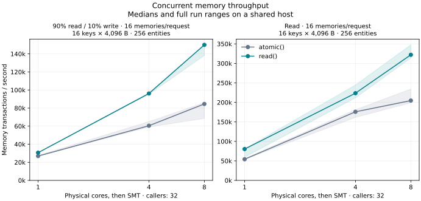

# Concurrent snapshot reads — 2026-09-08

`memory.read(snapshot => ...)` captures one committed native snapshot and runs a
synchronous callback with `get` and `list`. It skips the transaction lease,
idempotency lookup, socket setup, and commit operation used by `atomic()`.
Only requested values cross into JavaScript. Existing `atomic()` calls retain
their behavior; workers must use `read()` to take this path.

## Results

Local measurements, 32 callers and sixteen concurrent memories per request.
Both columns use the final implementation; only the read API differs.
Values are medians; gain is the median of the matched-pair ratios.

| Cores | Workload | Requests/s `atomic()` → `read()` | Paired gain | p99 ms `atomic()` → `read()` |
|---:|---|---:|---:|---:|
| 1 | 90% reads / 10% writes | 1,681 → 1,916 | 1.14× | 33.77 → 33.27 |
| 1 | Reads | 3,384 → 5,020 | 1.43× | 15.65 → 13.46 |
| 4 | 90% reads / 10% writes | 3,780 → 6,008 | 1.59× | 28.97 → 33.85 |
| 4 | Reads | 10,990 → 13,973 | 1.23× | 6.84 → 5.23 |
| 8 | 90% reads / 10% writes | 5,286 → 9,371 | 1.77× | 32.85 → 40.23 |
| 8 | Reads | 12,788 → 20,129 | 1.57× | 10.34 → 3.95 |

Eight-core rates are **149,939 memory transactions/s mixed** and **322,070
reads/s**. Mixed throughput scales 4.89× from one to eight cores with `read()`,
compared with 3.14× using `atomic()`. Read-only scaling is 4.01× versus 3.78×.
Scaling remains sublinear. Every final core-matrix pair improved throughput.



**Mixed-load tail latency regressed at saturation.** Four-core p99 rose from
28.97 to 33.85 ms; eight-core p99 rose from 32.85 to 40.23 ms. Read-only p99
improved at every measured core count. These runs do not separate read and
write request latencies, so they do not establish a write-latency improvement.

Eight-core holdouts:

| Workload | Requests/s `atomic()` → `read()` | Paired gain | p99 ms `atomic()` → `read()` |
|---|---:|---:|---:|
| Small values, 4 memories/request | 9,521 → 11,260 | 1.18× | 35.96 → 33.89 |
| Small values, 16 memories/request | 6,523 → 9,106 | 1.67× | 39.01 → 47.79 |
| Read-only, 16 hot entities | 8,348 → 43,150 | 5.21× | 6.12 → 1.80 |
| Mixed, 16 hot entities | 934 → 2,036 | 1.68× | 93.43 → 181.13 |
| Write-only control | 1,116 → 537 | 0.86× | 126.95 → 93.60 |
| Read-only, 128 MiB value population | 800 → 845 | 1.06× | 124.68 → 107.43 |

The hot-entity read-only improvement is a contention stress result, not the
headline workload. In the hot mixed case, candidate p99 ranged from 136.83 to
704.50 ms, versus 82.08–100.52 ms for `atomic()`; the throughput ratios ranged
from 1.01× to 2.18×. This workload remains limited by contended durable writes,
and the faster read path does not provide a tail-latency guarantee.

The cache-overflow case had about 93% native snapshot cache misses and gained
6% in paired throughput, with a range of approximately 1.00×–1.08×. Peak RSS
was about 1.6 GiB on both sides. In the main mixed workload, peak RSS was
essentially unchanged at about 625–627 MiB on eight cores.

**No write-throughput gain or non-regression claim is made.** The write-only
holdout had a −14% median paired difference, with ratios of 0.44×, 1.19× and
0.86×, despite identical timed write operations. A separate control using the
same executable and `atomic` setting on both sides, with 5s warmup and 20s
measurement, produced ratios of 0.90×, 0.88× and 0.97×. This establishes
measurement variability; it does not justify discarding unfavorable samples.

The [full results](MEMORY-READ-RESULTS.md) retain workload dimensions, paired
ranges, cache misses, commit density, CPU time and RSS. The [diagnostics](MEMORY-READ-DIAGNOSTICS.md)
contain the prototype runs and the identical-settings control. The 72 final
API-comparison processes validated 4,719,084 completed writes before shutdown
and after reopening.

## Consistency and resource lifetime

Every `get` and `list` in a callback observes the same entity snapshot. Reads
started after an acknowledged write see that write. A read overlapping a write
can observe the previously committed state while the write is still pending.
Snapshots across different entities are independent, including under
`Promise.all()`. Read-modify-write invariants still belong inside `atomic()`.

Snapshot views expose no mutations or effects. Async callbacks, returned
thenables, nested memory operations, and use after the callback are rejected.
Decoded values are independent copies. Request completion and cancellation
release native handles, which are limited to 128 per request and a 16 MiB
value payload per snapshot. Active reads can retain snapshots evicted from the
64 MiB cache, so that cache budget is not a total process-memory limit.

Cold loads for one entity share a load lock, independent of its transaction
lease. They recheck the cache after obtaining it. This prevents overlapping SQL
loads from filling the cache out of order during the interval between SQL
COMMIT and cache publication. The lock persists across cache resizing and
releases on cancellation. Other entities can load concurrently. The weak
reference catalog prunes inactive load locks once it reaches 4,096 keys.

The deterministic cold-load regression check failed before this coordination
was added. It pauses a SQL load before its cache fill, resizes the cache,
commits new state, and verifies that a second load waits for the first fill
before observing the new state. It also exercises another entity during the
pause and cancels a paused load to verify that subsequent reads can proceed.
The earlier benchmark runs are retained as prototype measurements.

The optional `memoryCommand` export from
`@mewhhaha/vite-plugin-dd/memory` maps a synchronous transition's writes,
deletes, effects, and result onto `atomic()`. It preserves idempotent replay and
requires synchronous results. It is an ergonomic wrapper, does not enforce
purity, and is not included as a performance optimization in these measurements.

## Method

Both sides use the same optimized executable, dependency lock and worker source.
`DD_FANOUT_READ_API` selects `atomic` or `snapshot` for read operations; seeding
and writes always use `atomic()`. Every response is checked, including monotonic
counts per caller and payload contents. Exact counters and all fields are
verified before shutdown and after reopening each fresh durable store.

The core matrix uses 32 callers, sixteen memories per request, 256 entities,
and sixteen varied 4 KiB values per entity. Each timed transaction validates
two values. Mixed traffic has 90% read requests and 10% requests that write
every memory in their fanout. Each pair uses two seconds of warmup and eight
seconds of timed work. Three pairs cover each workload and CPU count, reversing
workload and API order between rounds.

The holdouts use three seconds of warmup and twelve seconds of timed work,
with three pairs each on eight cores. They cover small values, four-memory
fanout, heavy contention over sixteen entities, write-only traffic, and a
128 MiB value population exceeding the 64 MiB native cache. A cache miss here
refers to the native snapshot cache; operating-system caching is not disabled.

The host is a Ryzen 7800X3D with physical-core affinity. Stores are on physical
NVMe with btrfs compression; temporary RAM filesystems are rejected by the
runner. Grouped `synchronous=FULL` commits, busy retries, version floors,
idempotency, and outbox durability remain in place. No profiling is enabled
in acceptance measurements. The host is shared, and unrelated jobs are left
running; complete run ranges are reported rather than confidence intervals.

These are in-process `RuntimeService` measurements. They include worker
execution and response validation, and exclude HTTP transport and Fly
networking. CPU time and peak RSS include setup and reopening as well as the
timed phase. Results are local measurements, not deployed Fly capacity.

## Verification and artifacts

All 407 workspace tests pass, with four existing ignored tests. Clippy passes
for all targets and features with warnings denied. JavaScript, TypeScript,
formatting, public API naming, and vendored source checks pass. The optional
wrapper's package export resolves from an example application's dependency.
The rebuilt HTTP server passes the physical-store SIGKILL check, using `read()`
to verify acknowledged memory writes and deletes after restart, idempotent
replay, and worker namespace isolation.

The [raw archive](/home/mewhhaha/dd-memory-read-20260908.tar.gz) contains all
116 benchmark processes, including prototype and control runs, with 7,318,700
completed writes checked. It includes manifests, raw samples, host telemetry,
build records, source patches, new source files, reproduction scripts, and
verification logs. Database files and executables are excluded.

Archive SHA-256:
`d05eb1965f6f22859655d795cedbdeb162a7719d807fea33fa36f922fd2ddabb`.

Final executable SHA-256:
`9bf02775e50faf8e23fa9552ba8bc36a9aac68dc73e684b07bf38352db07b810`.
Its build record identifies commit `4edca08cd8120cc98857c2fd5d8ba51010ad4bef`
plus source patch
`880fa9ef723e6ca20268d29da8625c8e0702d59ed87d7bfa7894621ba345846f`
and hashes for untracked source files. A final comparison verified that the
compiled sources, dependency lock, Cargo configuration, and measured harness
still match this build. Reports were added afterward.

To reproduce the core matrix from this workspace, use fresh output directories
on a physical filesystem. The build script is retained in the archive and at
the path below. Both benchmark sides deliberately use the same executable.

```sh
read_build=/home/mewhhaha/dd-memory-read-reproduction-build
read_results=/home/mewhhaha/dd-memory-read-reproduction-results
python3 /home/mewhhaha/dd-memory-read-tools-20260908/build-state-benchmarks.py \
  --source "$PWD" --target-dir "$PWD/target" --output "$read_build" \
  --bin bench_memory_fanout
mkdir "$read_build/bin"
cp target/dist/bench_memory_fanout "$read_build/bin/bench_memory_fanout"
python3 scripts/compare-memory-fanout.py \
  --baseline "$read_build/bin/bench_memory_fanout" \
  --baseline-record "$read_build/build-record.json" \
  --candidate "$read_build/bin/bench_memory_fanout" \
  --candidate-record "$read_build/build-record.json" \
  --baseline-read-api atomic --candidate-read-api snapshot \
  --output "$read_results" --pairs 3 --concurrency 32 \
  --warmup-ms 2000 --duration-ms 8000 \
  --cpu-count 1 --cpu-count 4 --cpu-count 8 \
  --case mixed:16:256:4096:16:varied --case read:16:256:4096:16:varied
```

The archive's `campaigns.json` records the holdout cases and durations;
`summarize-memory-fanout.py` regenerates the tables and scaling figure.
