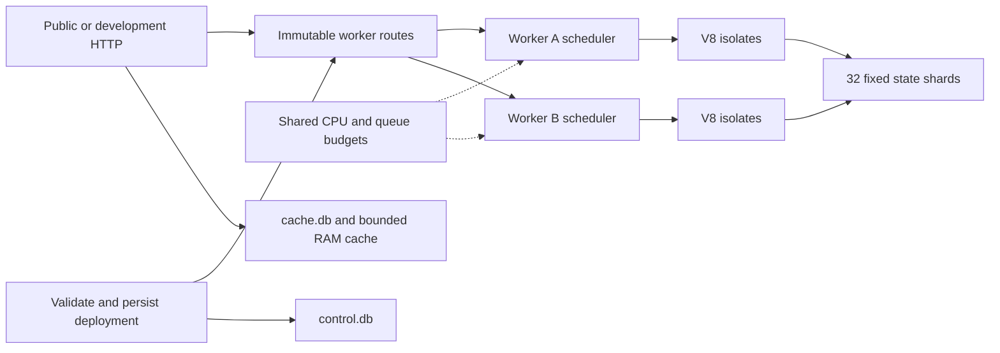

# Runtime architecture

`dd_server` owns a Deno/V8 runtime service and local Turso storage. Its public
HTTP endpoint and the native development binary use the same Hyper streaming
and WebSocket implementation. Development stdio carries deployment and control
messages; worker requests travel over loopback HTTP.

Each worker owns a scheduler task and its deployment generations. Invocations
route directly to that worker's bounded mailbox. Service-binding authorization
is checked by the caller's worker before forwarding through an internal lane.
Reserved internal capacity lets service calls progress when public requests
occupy regular capacity. A single worker can use the entire regular isolate
budget; the default follows available CPU parallelism, with a minimum of two.
Isolates start lazily by default.

Isolate permits remain held until the actual isolate thread exits. Cancellation
has a separate delivery lane, and isolate termination does not depend on space
in its command queue. A response waiting for a reader does not suspend its
worker scheduler. Buffered chunks retain byte permits until their last consumer
releases them, including after the producer has completed.

Service-binding fetches collect a complete response under the per-response
size limit. The shared streaming byte budget applies to public and development
HTTP response streams; it does not turn service-binding replies into streams.

## Default limits

| Resource | Default |
| --- | --- |
| Regular isolates across the service | Available CPU parallelism, minimum 2 |
| Additional isolates reserved for internal work | Same as the regular global budget |
| Regular isolates per worker | Same as the global default |
| Concurrent requests per isolate | 4 |
| Queued requests per worker | 1,024 |
| Reserved internal queued requests per worker | 64 |
| Queued requests across the service | 16,384 |
| Queued request bytes across the service | 64 MiB |
| Buffered upload bytes across HTTP requests | 64 MiB |
| Buffered streamed response bytes | 64 MiB |
| Isolate heap | 128 MiB |
| Startup timeout | 5 seconds |
| Request wall timeout | 30 seconds |
| Queue wait timeout | 30 seconds |

`RuntimeConfig` is authoritative for runtime limits. The server exposes upload
and response budgets as `DD_RUNTIME_MAX_BUFFERED_REQUEST_BYTES` and
`DD_RUNTIME_MAX_BUFFERED_RESPONSE_BYTES`, or corresponding
`--runtime-max-buffered-*-bytes` flags. Queue admission and live stream buffers
use separate budgets so readers can release capacity while queues are full.

## State and transactions

State identity is `(worker, binding, entity key)` for memory and
`(worker, binding, key)` for KV. It does not include deployment generation.
SHA-256 routing over length-prefixed identities selects one of 32 state shards;
a persisted manifest fixes that layout. Each shard has one writer and two
pooled readers. Writer admission has count and byte limits and grouped
`synchronous=FULL` commits. Version floors and tombstones persist across restarts.

Memory callbacks execute synchronously in the caller isolate under a shared
entity lease. The callback sees a complete snapshot and stages mutations and
effects. Storage retries the staged batch without re-executing JavaScript.
The queued commit retains the lease even if its request is canceled.
An optional idempotency key stores the callback result in the same transaction
as state and outbox effects. Async callbacks, nested transactions and returned
thenables fail; transaction handles cannot escape the callback.

One outbox coordinator scans and retries durable effects. Socket effects route
to the owning worker. Delivery may be retried, so effect consumers must account
for redelivery. Cache invalidation is published before durable acknowledgement;
reads use bounded shared caches of committed values. The response cache has its
own database and keeps recency updates in RAM.

## Deployment and recovery

Validation runs in a separately limited isolate with an external timeout and
heap limit. Successful deployments persist before their route is published.
Accepted deployment operations finish even if their client disconnects. An
invalid deployment leaves the previous generation serving requests.

New requests use the current generation. The previous generation receives at
most the configured request wall timeout to drain. Existing WebSockets receive
close code `1012`; a client ignoring that close cannot retain the generation
indefinitely. Expiring a temporary deployment only removes its own active
pointer, so it cannot remove a replacement deployed concurrently.

Old storage is never converted during startup. The [offline converter](storage-conversion.md)
uses a new destination, explicit ownership for ambiguous namespaces, logical
row hashes, source file hashes and an incomplete marker. Old bundles are
archived; rebuild and redeploy them for the current public API.

Run `just check`, `just check-state-crash`, and
`node scripts/check-dd-dev-transport.mjs` for the functional checks. Performance
acceptance additionally requires equivalent durable workloads, fixed CPU
affinity and disk-backed storage; see [benchmark instructions](../benchmarks/README.md).
