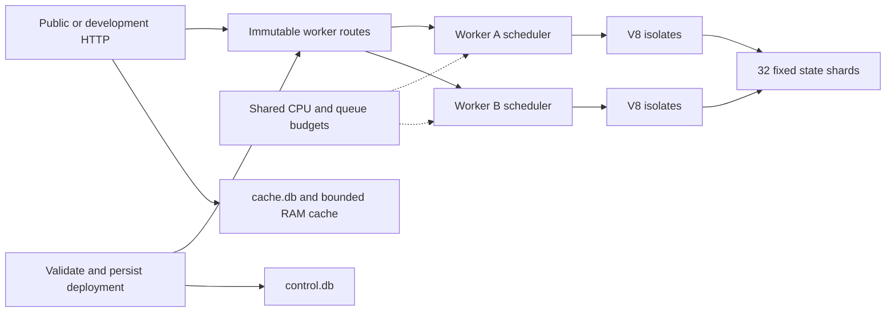

# Runtime architecture

`dd_server` owns a V8 runtime service and local Turso storage. Its public
HTTP endpoint and the native development binary use the same Hyper streaming
and WebSocket implementation. Development stdio carries deployment and control
messages; worker requests travel over loopback HTTP.

```mermaid
flowchart LR
  HTTP[Public or development HTTP] --> Routes[Immutable worker routes]
  Routes --> A[Worker A scheduler]
  Routes --> B[Worker B scheduler]
  A --> AV[V8 isolates]
  B --> BV[V8 isolates]
  Admission[Shared CPU and queue budgets] -.-> A
  Admission -.-> B
  AV --> State[32 fixed state shards]
  BV --> State
  Deploy[Validate and persist deployment] --> Routes
  Deploy --> Control[control.db]
  HTTP --> Cache[cache.db and bounded RAM cache]
```

Each worker owns a scheduler task and its deployment generations. Invocations
route directly to that worker's bounded mailbox. Service-binding authorization
is checked by the caller's worker before forwarding through an internal lane.
Reserved internal capacity lets service calls progress when public requests
occupy regular capacity. A single worker can use the entire regular isolate
budget; the default follows available CPU parallelism, with a minimum of two.
Isolates start lazily by default.

Isolate permits remain held until the actual isolate thread exits. Cancellation
has a separate delivery lane, and isolate termination does not depend on space
in its command queue. A response waiting for a reader does not suspend its
worker scheduler. Buffered chunks retain byte permits until their last consumer
releases them, including after the producer has completed.

`waitUntil` work has a native deadline measured from response completion, using
the configured request wall timeout. The scheduler terminates an expired
isolate even when its JavaScript event loop cannot process timers.

WebSocket frames retain per-session and shared service byte permits through
transport delivery. Budgets include frame metadata so empty messages are
bounded too. Full buffers cause durable socket effects to retry with backoff;
a frame that cannot fit the configured limits closes its socket with code
`1009` and is rejected.

Service-binding fetches collect a complete response under the per-response
size limit, checked incrementally while reading and canceling an oversized
producer. The shared streaming byte budget applies to public and development
HTTP response streams; it does not turn service-binding replies into streams.
HEAD replies and statuses 204, 205, and 304 have a null body. Aborting a service
fetch cancels its child invocation through the cancellation lane; cancellation
of the parent request also cancels its outstanding children.
Service and outbound fetches share native `Request` normalization and a bounded,
abortable body reader. FormData, Blob, URLSearchParams and stream bodies use the
standard encodings; aborts preserve the caller's reason and cancel the producer.

JSON control-plane requests reserve their maximum payload size from a shared
byte budget before reading. The reservation remains held through parsing and
deployment persistence, including when the client disconnects. Uploads have
a read deadline; a full budget rejects new requests with `503`.

## Default limits

| Resource | Default |
| --- | --- |
| Regular isolates across the service | Available CPU parallelism, minimum 2 |
| Additional isolates reserved for internal work | Same as the regular global budget |
| Regular isolates per worker | Same as the global default |
| Concurrent requests per isolate | 4 |
| Queued requests per worker | 1,024 |
| Reserved internal queued requests per worker | 64 |
| Queued requests across the service | 16,384 |
| Queued request bytes across the service | 64 MiB |
| Buffered upload bytes across HTTP requests | 64 MiB |
| Buffered control-plane JSON bytes | 64 MiB |
| Control-plane body read timeout | 30 seconds |
| Buffered streamed response bytes | 64 MiB |
| Buffered and in-flight WebSocket bytes across the service | 64 MiB |
| Buffered and in-flight WebSocket bytes per session | 1 MiB |
| Claimed durable outbox bytes across state shards | 64 MiB |
| Live memory value bytes per entity | 16 MiB |
| Live memory entries per entity | 16,384 |
| Live memory key and entry metadata per entity | 4 MiB |
| Isolate heap | 128 MiB |
| Startup timeout | 5 seconds |
| Request wall timeout | 30 seconds |
| Background work deadline after response completion | Request wall timeout |
| Queue wait timeout | 30 seconds |

`RuntimeConfig` is authoritative for runtime limits. The server exposes upload
and response budgets as `DD_RUNTIME_MAX_BUFFERED_REQUEST_BYTES` and
`DD_RUNTIME_MAX_BUFFERED_RESPONSE_BYTES`, or corresponding
`--runtime-max-buffered-*-bytes` flags. Queue admission and live stream buffers
use separate budgets so readers can release capacity while queues are full.
WebSocket budgets use `DD_RUNTIME_MAX_BUFFERED_WEBSOCKET_BYTES` and
`DD_RUNTIME_MAX_BUFFERED_WEBSOCKET_BYTES_PER_SESSION`. Control-plane limits use
`DD_CONTROL_MAX_BUFFERED_BODY_BYTES` and `DD_CONTROL_BODY_TIMEOUT_SECONDS`.
The outbox claim budget uses `DD_MEMORY_OUTBOX_MAX_CLAIMED_BYTES` or
`--memory-outbox-max-claimed-bytes`; it includes payload copies and effect metadata
and remains reserved until delivery tasks release their claims.
Each effect must fit that budget; lowering it below an already-persisted effect's
charge prevents that effect from being claimed until the budget is increased.

## State and transactions

State identity is `(worker, binding, entity key)` for memory and
`(worker, binding, key)` for KV. It does not include deployment generation.
SHA-256 routing over length-prefixed identities selects one of 32 state shards;
a persisted manifest fixes that layout. Each shard has one writer and two
pooled readers. Writer admission has count and byte limits and grouped
`synchronous=FULL` commits. Version floors persist across restarts. Memory deletes
remove entry rows while retaining entity and shard version floors; opening a
current-format shard compacts old memory tombstones. KV lists merge keys from
shards before loading the globally selected values.
KV cache hits share immutable value bytes and update recency in place. Deployment
history queries project summary metadata without loading source, assets, or modules;
individual deployment details still load the complete bundle.

Memory callbacks execute synchronously in the caller isolate under a shared
entity lease. Before the callback starts, its native transaction holds an
immutable snapshot from the shared cache. Reads consult staged mutations first,
then search the snapshot; only the requested value is copied into JavaScript
and decoded. Lists merge keys and apply ordering and limits before transferring
values. There is no second snapshot cache in each JavaScript isolate.
The callback stages mutations and effects. Storage retries the staged batch
without re-executing JavaScript.
The queued commit retains the lease even if its request is canceled.
JavaScript entity bookkeeping belongs to the request or transaction. Reused
isolates retain no catalog of entities previously accessed by atomic callbacks.
An optional idempotency key stores the callback result in the same transaction
as state and outbox effects. Async callbacks, nested transactions and returned
thenables fail; transaction handles cannot escape the callback.
Stored command results have a versioned envelope with Request/Response metadata
kept outside user objects. Replay preserves shared references and cycles without
treating user property names as type markers. Older unversioned results remain
readable; their Request/Response records are recognized by their complete shape.

Read-only callbacks use `memory.read(snapshot => ...)`. A separate native handle
retains one committed immutable snapshot, with no entity lease, command lookup,
socket setup, or commit operation. Concurrent readers can retain the previous
snapshot while a writer commits and publishes its replacement. Cache misses
load a snapshot with one SQL query. Cache hits use the qualified entity key
directly; shard routing is computed only when a SQL load is needed.
Cold loads for the same entity share a load lock, separate from the write
lease, and recheck the cache after acquiring it.
This prevents overlapping SQL loads from publishing out of order during the
COMMIT-to-cache-publication interval. Load locks survive cache resizing and
release on cancellation; their weak-reference catalog prunes inactive entries
once it reaches 4,096 keys. Shard epochs prevent an old fill from replacing a
snapshot after a commit. A read started after an acknowledged write
observes that write. Each callback sees one entity snapshot, not a snapshot
across entities. The API exposes only `get` and `list`, rejects async and nested
callbacks, and invalidates the view after the callback. Native read handles are
limited to 128 per request; completion and cancellation release them. Storage
checks live value bytes, entry count, and key/entry metadata inside the write
transaction. Existing oversized entities remain writable when a batch reduces
an exceeded limit without increasing another exceeded limit, allowing deletion
and recovery. Read-only callbacks reject oversized snapshots. Reads do not create
isolate entry metadata.

One outbox coordinator scans and retries durable effects. Persisted ordinals
preserve commit and callback order; an undelivered predecessor blocks later
effects for that entity, including during retry backoff. Socket effects route
to the owning worker. Claims share a payload byte budget across shards, and the
coordinator retains reservations through socket delivery. Delivery may be retried,
so effect consumers must account for redelivery. Periodic scans rotate their first
shard so byte-budget exhaustion cannot repeatedly favor the same shards.
Cache invalidation is published before durable acknowledgement;
reads use bounded shared caches of committed values. The response cache has its
own database and keeps recency updates in RAM. The opt-in front cache is keyed by
the persisted deployment ID, so redeployment cannot reuse old responses or be
repopulated by a late response from the previous generation. Restarting the same
deployment retains its cache namespace.
Cache fills retain the selected activation and are discarded if it changes before
the origin response completes, including during rollback or undeploy.

Readiness and checkpointing operate on the shared state store once, alongside
the control and response-cache databases. Checkpoint responses report
`state_shards`, `control`, and `cache` to describe these physical stores.

## Deployment and recovery

Validation runs in a separately limited isolate with an external timeout and
heap limit. Successful deployments persist before their route is published.
Accepted deployment operations finish even if their client disconnects. An
invalid deployment leaves the previous generation serving requests.
Drain and checkpoint checks count accepted control work and deployment operations
through publication. Server shutdown closes deployment admission; after its grace
period, it cancels queued deployment work and validation, waits for validation
threads and any started persistence to finish, then stops the runtime.

New requests use the current generation. The previous generation receives at
most the configured request wall timeout to drain. Existing WebSockets receive
close code `1012`; a client ignoring that close cannot retain the generation
indefinitely. Expiring a temporary deployment only removes its own active
pointer, so it cannot remove a replacement deployed concurrently.

Storage from before routing format 2 is never converted during startup. The [offline converter](storage-conversion.md)
uses a new destination, explicit ownership for ambiguous namespaces, logical
row hashes, source file hashes and an incomplete marker. Old bundles are
archived; rebuild and redeploy them for the current public API.

Run `just check`, `just check-state-crash`, and
`node scripts/check-dd-dev-transport.mjs` for the functional checks. Performance
acceptance additionally requires equivalent durable workloads, fixed CPU
affinity and disk-backed storage; see [benchmark instructions](../benchmarks/README.md).

The worker JavaScript source order lives in
`crates/runtime/js/execute_worker/units.txt`. Rust builds and `pnpm check:worker-js`
read that same list; `just check-js` checks the assembled scope for undefined and
unused bindings. Native operations are organized by KV, cache, HTTP, response,
memory and request control responsibilities.

The runtime's own JavaScript (`core/core.js`, the web layer, `bootstrap.js` and
the execute-worker bundle) runs once while the bootstrap snapshot is built, each
script as the body of a function. `core.js` returns the bootstrap object (the
ops, the web layer's shared state and dd's request machinery under `dd`); every
later script receives it as its `__bootstrap` parameter, and the snapshot keeps
it as the runtime's internals, which only the host reads. Nothing these scripts
declare is global, so worker code reaches no op: it sees the web platform
globals, its bindings and `__dd_async_context` (the AsyncLocalStorage half that
dd-vite's `node:async_hooks` shim uses). The development runtime adds
`__dd_raw_host_fetch`; the runtime's tests and benchmarks set
`RuntimeConfig::expose_internals` to reach the bootstrap object as
`__dd_internals`.
